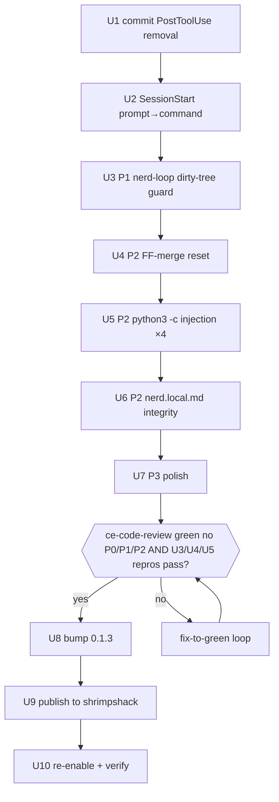

# Nerd Hooks Cleanup + Bug Sweep - Plan

**Target repo:** this worktree — `feature/nerd-fixes` (branched from `main` `2b7add2`).
All paths repo-relative to the nerd plugin root.

**Product Contract preservation:** unchanged from the requirements-only source —
this enrichment adds HOW (units, verification, sequencing) without altering scope or
success criteria.

---

## Goal Capsule

**Objective.** Make the `nerd` plugin safe to re-enable. It was disabled this session
("breaking all my sessions") because a `PostToolUse Write|Edit` hook of `type: prompt`
injected an instruction after *every* file edit. Finish the hook cleanup, fix the
autonomous-action bugs an adversarial audit surfaced, **publish** so the installed
plugin actually loses the bad hook, then re-enable and verify.

**Product authority.** Shawn. Scope confirmed 2026-06-28: full sweep (hook core + the
verified P1 + all three P2 integrity bugs + cheap P3 polish).

**Open blockers.** None. The P1 fix-shape is resolved (start-time dirty-tree guard; the
in-loop reset is correct once the tree starts clean — see KTD-1).

---

## Why now

Disable (`nerd@local-dev=false`, `nerd@shrimpshack=false` in `~/.claude/settings.json`)
is a stopgap. The real fix is in source but **not published**: the installed
`nerd@shrimpshack` cache still carries the live per-edit hook, and the plugin `version`
is still `0.1.2` in both source and cache — so the marketplace won't re-pull
(same-version-different-content) and any user stays broken. Separately, an adversarial
audit found a live **data-loss** path (`/nerd-loop`) that is the *same class* of bug as
the one that got nerd disabled — autonomous action damaging the user's session — just
via a different mechanism. Re-enabling without fixing it would leave that path live.

---

## Product Contract (carried from brainstorm — WHAT, unchanged)

### Scope — must-fix

**Hook core:** commit the PostToolUse hook removal onto this branch (today it exists
only as an uncommitted edit in the *main* repo, NOT in this worktree); convert the
SessionStart hook from `type: prompt` to `type: command` (silent on empty backlog).

**Verified bugs (adversarial audit 2026-06-28):**
- **P1** — `/nerd-loop` destroys uncommitted work present when the loop starts
  (`git checkout -b` in the main tree + in-loop `git reset --hard HEAD` on failure, with
  no start-time dirty-tree guard).
- **P2** — `worktree-lifecycle` `git reset --hard HEAD~1` leaves a partial merge on
  fast-forward.
- **P2** — shell vars f-stringed into `python3 -c` (code-injection class).
- **P2** — `.claude/nerd.local.md` (gitignored, unrecoverable) has no atomic-write
  protocol.

**Publish + re-enable:** bump `0.1.2 → 0.1.3`; publish to shrimpshack; re-enable + verify.

**Cheap P3 polish:** stale `README.md` hook claim; `cp` empty-`build_output_dir` guard;
`commands/nerd-this.md:303` stray comment.

### Scope — out
- `/nerd-intern reset` `rm -rf .nerd/intern/eval/` — traced safe (hardcoded literal path).
- No new features, no DAG/intern redesign, no param-scan rework (wiring verified sound).
- No changes to the adjacent `feature/rubric-judged-experiments` worktree.

### Success criteria
- Installed `nerd@shrimpshack` (post-publish, post-update) has **zero** `PostToolUse`
  hook; a Write/Edit produces no injected param-scan prompt.
- SessionStart emits nothing on an empty backlog; one concise `additionalContext` line
  when there's something actionable.
- `/nerd-loop` aborts/stashes when the working tree is dirty at start, so pre-existing
  uncommitted work is never destroyed by a failed iteration's `git reset --hard`. (The
  in-loop reset then discards only the loop's own experimental edits — correct
  iteration-discard behavior. A concurrent user edit to the same tree *during* an
  autonomous run is a residual closed only by the deferred worktree isolation.)
- The three P2 integrity bugs are fixed and empirically demonstrated.
- `/ce-code-review` passes with no remaining P0/P1/P2 **and** the U3/U4/U5 empirical
  repros are recorded-passing — both **before** publish.
- `nerd@shrimpshack` re-enabled; `nerd@local-dev` deliberately left disabled (see KTD-6).

---

## Planning Contract (HOW)

### Key Technical Decisions

**KTD-1 — P1 fix: start-time dirty-tree guard; defer worktree isolation.** The actual
data-loss is pre-existing uncommitted work present when the loop *starts*: `/nerd-loop`
runs `git checkout -b` in the main tree (`commands/nerd-loop.md:176`) with no dirty-tree
check, then the in-loop `git reset --hard HEAD` (`:211`, `:224`, inside the Step-5
executor) wipes it on the first failed iteration. The fix is a start-of-run guard:
before the branch is created at `:176`, if `git status --porcelain` is non-empty, abort
(interactive: offer `git stash --include-untracked`; scheduled/headless: stop with a
clear message — never auto-reset a dirty tree). This mirrors the codebase's own guard at
`skills/worktree-lifecycle/SKILL.md:54`. With a clean tree guaranteed at start, the
in-loop `git reset --hard HEAD` is left **unchanged** — it then discards only the loop's
own experimental edits each failed iteration, which is correct discard behavior and
preserves iteration isolation. (A scope-limited revert was considered and rejected: it
would leave the loop's own out-of-scope edits in the tree across iterations,
contaminating later TEST/MEASURE runs and risking a bogus committed "win.") **Residual:**
a user editing the same working tree *concurrently* during an autonomous run is still
exposed to the in-loop reset; the complete fix is full `git worktree`-based isolation
(matching `/nerd`), a larger refactor with new failure surfaces (cleanup, ports) →
Deferred to Follow-Up Work.

**KTD-2 — `python3 -c` injection fix: pass via `sys.argv` at ALL four sites.** Replace
`open('$DAG_PATH')` / `'${INTERN_MODEL}'` interpolation with values passed as positional
args and read inside the script (`sys.argv[1]`). The fix is the identical argv transform
at every site, so the full injection class is closed — not just the two live-shell-var
sites (`commands/nerd.md:93`, `skills/intern-delegation/SKILL.md:24`) but also the two
model-template cousins (`agents/report-compiler.md:323`,
`agents/loop-scout.md:191`), which build the same `python3 -c "...open('{dag_path}...')"`
from a DAG path derived from the project directory and run at the end of every full
`/nerd` pipeline. Leaving them would also risk the `/ce-code-review` gate re-flagging the
same class as a remaining P2 before publish (success-criterion conflict).

**KTD-3 — `nerd.local.md` integrity: backup-before-rewrite + append-only instruction.**
The file is markdown, not JSON, so the DAG's `json.load` validation doesn't transfer.
Apply the same *crash-safe spirit* as the DAG (`agents/report-compiler.md`): the backup
step is the `cp … .bak` at `:308-310`, the tmp-write/validate/rename at `:316-329` — any
full rewrite copies the prior file to `.bak`, writes `.tmp`, then `mv`. For model-driven
backlog/config writes, the instruction is **append via Edit, never full Write** — a full
Write is what drops sibling sections. This is a documentation/protocol fix in the
command/agent prose, not a new script.

**KTD-4 — SessionStart command script.** No `hooks/*.sh` or `scripts/` exists today —
the script is written from scratch at `hooks/sessionstart-status.sh`. The hook entry uses
the established sibling-plugin convention `"command": "bash
${CLAUDE_PLUGIN_ROOT}/hooks/sessionstart-status.sh"` (as `auto`/`claude-modes` do in this
marketplace, and per the plugin-dev hook-development skill) — the `bash` prefix also
removes any dependency on the script's git executable bit (which `git archive` would
otherwise have to preserve). The script reads `.claude/nerd.local.md` and
`~/.claude/plugins/nerd/intern/state.json` directly and prints a single
`additionalContext` line to stdout ONLY when there's something actionable; otherwise it
emits nothing and **exits 0**. Critical: with `set -euo pipefail`, a `grep -c` that
matches zero lines exits non-zero and would abort the hook — the empty/no-match paths
must be neutralized (`|| true`, or `set +e` around counting) so the no-backlog case never
exits non-zero. A hook that errors on every SessionStart would reproduce the exact
"breaks sessions" class this work removes. All variables quoted; every file read guarded.

**KTD-5 — publish gates on BOTH controls.** Before the version bump + publish (U8/U9),
**two** controls must pass: (a) `/ce-code-review` green — no remaining P0/P1/P2 AND a
review round that surfaces no new P0/P1/P2 (not merely shrinking findings); AND (b) the
U3/U4/U5 empirical repros recorded-passing. The plan's own thesis is that green review
*misses* this destructive class, so the empirical repros are a hard publish dependency,
not just a DoD checkbox. Nothing destructive ships until both pass.

**KTD-6 — re-enable `nerd@shrimpshack` only; leave `nerd@local-dev` disabled.** The
published shrimpshack install is the canonical path for normal use; re-enabling
`nerd@local-dev` too would double-load nerd (two copies of the same hooks/commands). U10
flips `nerd@shrimpshack` back on and leaves `nerd@local-dev` off. (If Shawn later wants
local-dev for active development, that's a deliberate separate toggle, not part of this
fix.)

### High-Level Sequencing

*Arrows into and among U3–U7 denote review-batching order (one PR), not hard
dependencies — those units declare no dependencies and may be implemented in any order.
Only U1→U2, the U7→GATE handoff (the gate runs after the work is complete), and the
GATE→U8→U9→U10 publish tail are real dependencies.*

---

## Implementation Units

### U1. Commit the PostToolUse hook removal onto this branch
- **Goal:** Remove the `PostToolUse Write|Edit` block from `hooks/hooks.json` and update
  the file description to note removal + on-demand replacement.
- **Requirements:** Hook core (success: zero PostToolUse hook).
- **Dependencies:** none.
- **Files:** `hooks/hooks.json`.
- **Approach:** Delete the entire `"PostToolUse": [...]` array (lines 15-25). Replace the
  `description` with the note already used in main's working tree: *"… (PostToolUse
  param-scan hook removed 2026-06-28 — a type:prompt hook firing on every Write/Edit
  interrupted every turn; run /nerd-this or /nerd to scan for tunable parameters on
  demand instead.)"* Leave the SessionStart block in place (U2 converts it).
- **Patterns to follow:** the exact description text in the main repo's uncommitted
  `hooks/hooks.json` diff.
- **Test scenarios:** Verify `jq '.hooks.PostToolUse' hooks/hooks.json` returns `null`;
  `jq .` parses (valid JSON); `grep -c PostToolUse hooks/hooks.json` == 1 (description
  mention only). Covers success criterion "zero PostToolUse hook" at source level.
- **Verification:** `hooks.json` parses and has no PostToolUse hook entry.

### U2. Convert the SessionStart hook from `type: prompt` to `type: command`
- **Goal:** Replace the prose-injection SessionStart hook with a quiet command script
  that emits `additionalContext` only when actionable.
- **Requirements:** Hook core (success: silent on empty backlog).
- **Dependencies:** U1.
- **Files:** `hooks/hooks.json` (SessionStart block), `hooks/sessionstart-status.sh`
  (new).
- **Approach:** In `hooks.json`, change the SessionStart hook to
  `{"type": "command", "command": "bash ${CLAUDE_PLUGIN_ROOT}/hooks/sessionstart-status.sh"}`
  (KTD-4 — the `bash`-prefixed `${CLAUDE_PLUGIN_ROOT}` form sibling plugins use; no
  exec-bit dependency). The script: `set -euo pipefail`; read `.claude/nerd.local.md` if
  present; count `status: proposed` and detect `status: running` entries whose worktree is
  absent (`git worktree list` — guard for non-git cwd); read
  `~/.claude/plugins/nerd/intern/state.json` if present (promotion within 7d, endpoint
  health). Emit at most one concise line to stdout as `additionalContext`; emit nothing
  and **exit 0** when there's nothing actionable. Neutralize zero-match `grep -c` /
  empty-file cases so `pipefail` never makes the no-backlog path exit non-zero (KTD-4).
  Parse any endpoint response via `python3 … json.load(sys.stdin)` (the safe sibling
  pattern at `skills/intern-delegation/SKILL.md:93`) — never `eval`/word-split file or
  endpoint content. All variables quoted; every file read existence-guarded.
- **Patterns to follow:** the data the old prompt surfaced (`hooks/hooks.json:10`) — same
  signals, computed deterministically; `${CLAUDE_PLUGIN_ROOT}` hook form from sibling
  shrimpshack plugins.
- **Execution note:** write the script's fail-safe cases first (no backlog file / non-git
  cwd / missing intern state / zero matches all → silent **exit 0**) before the
  actionable-output path.
- **Test scenarios:**
  - Empty/absent `.claude/nerd.local.md` → script prints nothing, **exit 0** (assert exit
    code, not just empty stdout — this is the regression that would re-break sessions).
  - Backlog with 2 `proposed` entries → prints one line naming the count.
  - `running` entry with no matching worktree → prints the stale-worktree warning.
  - Run from a non-git directory → no error, exit 0, silent or backlog-only output.
  - `bash -n hooks/sessionstart-status.sh` passes; `shellcheck` clean if available.
- **Verification:** SessionStart produces no output AND exit 0 on an empty backlog, and
  one line when entries exist; `hooks.json` parses.

### U3. Fix P1 — `/nerd-loop` data-loss (start-time dirty-tree guard, KTD-1)
- **Goal:** Prevent `/nerd-loop` from deleting the user's pre-existing uncommitted work
  via the in-loop `git reset --hard`.
- **Requirements:** P1; success criterion "/nerd-loop aborts/stashes when dirty at start".
- **Dependencies:** none (independent of hooks; ordered here for review batching).
- **Files:** `commands/nerd-loop.md` (Step 3 branch-creation ~`:163-176`; the scheduled
  branch at `:171`; the in-loop `git reset --hard HEAD` sites `:211`/`:224` are
  referenced but left unchanged).
- **Approach:** Before `git checkout -b nerd-loop/{focus-slug}` (`:176`), add a start-time
  guard: if `git status --porcelain` is non-empty, STOP (interactive: offer
  `git stash --include-untracked`; scheduled/headless: abort with a clear message — never
  auto-reset a dirty tree). Mirror `skills/worktree-lifecycle/SKILL.md:54`. Leave the
  in-loop `git reset --hard HEAD` at `:211`/`:224` unchanged: with a clean tree at start,
  it discards only the loop's own experimental edits per failed iteration (correct
  iteration-discard, preserves isolation — see KTD-1 on why a scoped revert was rejected).
  State the residual in the unit: a concurrent user edit during the autonomous run is not
  protected by this guard; full worktree isolation (deferred) is the complete fix.
- **Patterns to follow:** `skills/worktree-lifecycle/SKILL.md:54` (dirty-tree skip-guard).
- **Execution note:** characterize-first via empirical repro — prove the old path
  destroys work before changing it.
- **Test scenarios (empirical — VERIFICATION BAR):**
  - **Throwaway-repo repro:** in a fresh `git init` repo, with a **tracked** uncommitted
    edit present at loop start, drive the documented loop sequence to the in-loop
    `git reset --hard HEAD` → confirm the OLD sequence (no guard) DESTROYS the tracked
    uncommitted edit. FIXED start-time guard ABORTS/stashes before the branch is created;
    the tracked edit survives. (`git reset --hard` does NOT remove *untracked* files — the
    repro asserts tracked-edit loss only; the guard additionally prevents untracked work
    being carried onto the loop branch.)
  - **Clean tree:** guard is a no-op; the loop proceeds and the in-loop reset discards
    only the iteration's own experimental edits (last-known-good restored) — no user data
    at risk.
  - Scheduled-mode shape (`commands/nerd-loop.md:171` scheduled branch — the loop's own
    scheduled entry, distinct from `nerd-schedule.md:121` which launches `/nerd`) → guard
    aborts rather than prompting.
  - `bash -n` on the extracted guard snippet; fail-safe probe with `git status` empty vs
    non-empty.
- **Verification:** the repro shows the tracked edit destroyed on old, preserved on fixed.

### U4. Fix P2 — fast-forward merge leaves a partial merge
- **Goal:** Make the tests-fail revert reset to the true pre-merge commit, not a fixed
  `HEAD~1`.
- **Requirements:** P2 (FF-merge integrity).
- **Dependencies:** none.
- **Files:** `skills/worktree-lifecycle/SKILL.md` (§Merge, `:59` and the surrounding
  merge/revert region; the Verify note at `:81`).
- **Approach:** Capture `PRE=$(git rev-parse HEAD)` immediately before
  `git merge "$WT_BRANCH" --no-edit`; on clean-merge-but-tests-fail, `git reset --hard
  "$PRE"` instead of `git reset --hard HEAD~1` (robust to both FF and merge-commit cases
  and to multi-commit branches). The Verify note at `:81` ("a tests-fail case left the
  source branch at its pre-merge commit") is the *intended invariant* and stays as-is —
  the change makes the captured-SHA reset actually *satisfy* it (do not weaken or delete
  the note).
- **Patterns to follow:** the existing conflict-case handling at `:67` (this adds the
  missing FF case).
- **Execution note:** characterize-first via empirical repro.
- **Test scenarios (empirical — VERIFICATION BAR):**
  - **Throwaway-repo repro:** base branch unmoved since worktree cut + worktree branch
    carrying ≥2 commits (build + run, per the two-phase executor) → merge
    fast-forwards; on tests-fail the OLD `reset --hard HEAD~1` leaves a build/harness
    commit applied to the source branch (dirty, test-failing). Confirm the corruption.
  - **Fixed path:** same setup → `reset --hard "$PRE"` returns the source branch exactly
    to its pre-merge commit (satisfying the `:81` invariant); `git log` shows no leftover
    commit; tree clean.
  - **Merge-commit case (non-FF):** fix still reverts cleanly (captured SHA covers both).
  - `bash -n` on extracted snippet.
- **Verification:** repro shows leftover commit on old, clean revert on fixed; the `:81`
  invariant now holds.

### U5. Fix P2 — shell/template vars interpolated into `python3 -c` (KTD-2)
- **Goal:** Eliminate the code-injection class by passing values as args at all four
  sites.
- **Requirements:** P2 (injection).
- **Dependencies:** none.
- **Files:** `commands/nerd.md` (`:93`), `skills/intern-delegation/SKILL.md` (`:24`),
  `agents/report-compiler.md` (`:323`), `agents/loop-scout.md` (`:191`).
- **Approach:** `commands/nerd.md:93` → `python3 -c 'import json,sys;
  print(json.load(open(sys.argv[1])).get("project_path",""))' "$DAG_PATH"`.
  `skills/intern-delegation/SKILL.md:24` → pass `$INTERN_MODEL` as `sys.argv[1]` (or via
  env), referenced inside the script, never f-stringed into the `-c` body.
  `agents/report-compiler.md:323` and `agents/loop-scout.md:191` → same argv transform
  for the `{dag_path}.tmp` validation: `python3 -c 'import json,sys;
  json.load(open(sys.argv[1]))' "{dag_path}.tmp"`. Keep all `2>/dev/null` and exit-code
  semantics identical.
- **Patterns to follow:** the safe sibling at `skills/intern-delegation/SKILL.md:93`
  (`json.load(sys.stdin)` — no interpolation).
- **Test scenarios:**
  - A project directory name containing a single quote (`it's-a-repo`) → at each of the
    four sites the fixed code reads the JSON correctly with no `SyntaxError`, no shell
    breakage; confirm the OLD interpolated form errors/injects on the same input.
  - Normal path → identical output to before (`project_path` extracted; DAG `.tmp`
    validation passes/fails as before).
  - `INTERN_MODEL` with a quote → health check evaluates without injection.
  - `bash -n` on each edited snippet.
- **Verification:** quote-bearing inputs no longer break or inject at any of the four
  sites; normal inputs unchanged.

### U6. Fix P2 — `.claude/nerd.local.md` integrity (KTD-3)
- **Goal:** Prevent full-rewrite / crash from dropping sibling sections of the critical
  gitignored state file.
- **Requirements:** P2 (state integrity).
- **Dependencies:** none.
- **Files:** `commands/nerd-this.md` (backlog append `:378`, `:448`; build_cache `:494`),
  `commands/nerd.md` (defaults write), `agents/lab-tech.md` (`build_cache` write
  `~:288`).
- **Approach:** Two-part protocol fix in the command/agent prose: (1) backlog/config
  updates MUST append via Edit, never a full `Write` of the file; (2) any operation that
  does rewrite the whole file first copies it to `.claude/nerd.local.md.bak`, writes to
  `.tmp`, then `mv` — the crash-safe spirit of the DAG writer (backup `cp … .bak` at
  `agents/report-compiler.md:308-310`; tmp-write/validate/rename at `:316-329`; markdown
  can't `json.load`-validate, so the safety is backup + atomic rename, not schema
  validation). Add an explicit invariant: sibling sections (`intern:`, `test_command`,
  `build_cache_*`, `backlog:`) must survive every write.
- **Patterns to follow:** the backup + atomic-rename mechanics of the DAG writer —
  `cp … .bak` at `agents/report-compiler.md:308-310` and the `mv` rename at `:329`. Do
  NOT copy the `json.load` validate line at `:323` verbatim: that is the interpolated
  `python3 -c` U5 is fixing, and markdown can't be `json.load`-validated anyway — the
  safety here is backup + atomic rename, not schema validation.
- **Coordination note:** U6 and U7 both edit `commands/nerd.md` and
  `agents/lab-tech.md (~:288)` for different fixes; land them in order (U6 then U7) and
  re-check the surrounding region after the first edit to avoid clobbering.
- **Test scenarios:**
  - Simulate a backlog append that uses full `Write` (the bug) vs Edit-append (the fix)
    on a file containing `intern:` + `backlog:` → fix preserves `intern:`; document that
    full-Write drops it.
  - Rewrite path → `.bak` exists after, original content recoverable from `.bak`.
  - `Test expectation:` prose/protocol change — verification is the preserved-siblings
    demonstration above (this is the empirical demonstration for this P2; markdown
    command instructions, not a unit test).
- **Verification:** a write that previously dropped `intern:` now preserves it; a `.bak`
  is produced before any rewrite.

### U7. P3 polish (README, cp guard, stray comment)
- **Goal:** Close the three cheap correctness/doc P3s.
- **Requirements:** P3 polish.
- **Dependencies:** none.
- **Files:** `README.md`; `commands/nerd.md` (`:404`), `agents/lab-tech.md` (`~:288`);
  `commands/nerd-this.md` (`:303`).
- **Approach:** (a) `README.md` — replace the "A PostToolUse hook watches as you code…
  silently adds them to the backlog" claim with the on-demand `/nerd-this` / `/nerd`
  reality. (b) `cp -c -r "$PROJECT_ROOT/{build_output_dir}/"` — guard the empty
  `build_output_dir` case (skip the copy / error rather than copying `$PROJECT_ROOT/`
  wholesale). (c) Fix the out-of-sequence forward-reference comment at
  `commands/nerd-this.md:303`.
- **Coordination note:** see U6 — shares `commands/nerd.md` / `agents/lab-tech.md (~:288)`
  edit regions; land after U6.
- **Test scenarios:**
  - `grep -i "watches as you code" README.md` → no match after.
  - Empty `build_output_dir` → copy is skipped, not a whole-root copy (probe the snippet
    with the var empty).
  - `Test expectation: none` for the comment fix (clarity only).
- **Verification:** README reflects on-demand scanning; empty-var cp is guarded.

### U8. Bump plugin version `0.1.2 → 0.1.3`
- **Goal:** Make the marketplace re-pull (version-gated store, KTD-5 prerequisite).
- **Requirements:** Publish.
- **Dependencies:** U1–U7 AND the KTD-5 gate — **both** `/ce-code-review` green (no
  P0/P1/P2) AND the U3/U4/U5 empirical repros recorded-passing. Do not bump/publish until
  both pass.
- **Files:** `.claude-plugin/plugin.json`.
- **Approach:** `version` → `0.1.3`. (The shrimpshack `marketplace.json` lives in the
  marketplace repo, bumped in U9.)
- **Test scenarios:** `jq -r .version .claude-plugin/plugin.json` == `0.1.3`; file
  parses. `Test expectation: none` beyond manifest validity.
- **Verification:** version reads `0.1.3`.

### U9. Publish to the shrimpshack marketplace
- **Goal:** Vendor the fixed tree into `shawnroos/shrimpshack` and bump its
  `marketplace.json` so the store serves the fix.
- **Requirements:** Publish.
- **Dependencies:** U8 (and the KTD-5 gate).
- **Files:** `~/.claude/plugins/marketplaces/shrimpshack/plugins/nerd/**` (vendored),
  `~/.claude/plugins/marketplaces/shrimpshack/.claude-plugin/marketplace.json`.
- **Approach:** Per memory `shrimpshack_marketplace_publish_workflow`: **land the fix on
  nerd `main` first** (merge `feature/nerd-fixes`) so the vendored `git archive HEAD` is
  the fixed tree, not the branch. Then from the marketplace repo: `git rm -r plugins/nerd`,
  then `mkdir -p <marketplace>/plugins/nerd` (required — `tar -x -C` does NOT create its
  target directory, and `git rm -r` removed it), then `git archive HEAD | tar -x -C
  <marketplace>/plugins/nerd` from the nerd repo to vendor exactly the tracked tree; bump
  nerd's `version` to `0.1.3` (and refresh description if needed) in `marketplace.json`;
  validate JSON; commit `publish: nerd 0.1.2 → 0.1.3 (...)`; `git push origin main`.
- **Test scenarios:** `marketplace.json` parses and nerd entry shows `0.1.3`; vendored
  `plugins/nerd/hooks/hooks.json` has zero PostToolUse hooks
  (`grep -c PostToolUse` == 1, description only). `Test expectation: none` beyond these
  content checks.
- **Verification:** marketplace `main` carries nerd `0.1.3` with the fixed hooks.json.

### U10. Re-enable + verify
- **Goal:** Flip nerd back on and confirm the fix propagated and behaves on the INSTALLED
  plugin.
- **Requirements:** Re-enable; all success criteria.
- **Dependencies:** U9.
- **Files:** `~/.claude/settings.json` (`enabledPlugins`) — flipped by
  `claude plugin enable`, not hand-edited.
- **Approach:** `/plugin marketplace update shrimpshack` (refresh FIRST — the
  easy-to-forget step), then `/plugin` update nerd, then `claude plugin enable
  nerd@shrimpshack` (leave `nerd@local-dev` disabled — KTD-6). `/reload-plugins`. Use
  `enable`/`disable` — NOT `uninstall` (scope bug, memory
  `plugin-uninstall-scope-bug-use-disable`).
- **Test scenarios (acceptance — exercise the INSTALLED cache, not source):**
  - After update, the installed cache `hooks/hooks.json` has zero PostToolUse hooks.
  - Perform a Write/Edit in a session → NO injected param-scan prompt fires.
  - SessionStart with a `proposed` entry present → one concise line appears. (This is the
    positive signal that the command hook actually FIRES — the empty-backlog "silent"
    case can't distinguish silent-success from silent-failure, so a non-empty backlog
    check is required to prove the hook runs.)
  - SessionStart with an empty `.claude/nerd.local.md` → no nerd prose injected, no hook
    error.
  - **Live `/nerd-loop` check (post-publish re-confirmation of U3):** with the published
    plugin enabled, run `/nerd-loop` against a dirty throwaway repo and confirm the live
    executor aborts/stashes instead of resetting — exercises the fixed prose against the
    real (now-installed) artifact. The pre-publish control for U3 is the shell repro; this
    is the belt-and-suspenders confirmation once the fix is actually installable.
  - `settings.json` shows `nerd@shrimpshack: true`, `nerd@local-dev: false`.
- **Verification:** all acceptance checks pass in a live session against the installed
  plugin.

---

## Verification Contract

**Hard gate (KTD-5) — a conjunction, both required before U8/U9/U10:**
1. `/ce-code-review` green — no remaining P0/P1/P2 AND a review round that surfaces no new
   P0/P1/P2 findings (not merely shrinking findings).
2. The U3/U4/U5 empirical repros recorded-passing (the strong control — the plan's thesis
   is that #1 alone misses this destructive class).

**Empirical bar for destructive fixes (non-negotiable — this is the class green review
misses):**
- **U3 (P1):** a throwaway-`git`-repo repro — a tracked uncommitted edit present at loop
  start is destroyed by the OLD path (no guard) and preserved by the FIXED start-time
  guard. (`git reset --hard` does not remove untracked files — the repro asserts
  tracked-edit loss only.)
- **U4 (P2):** throwaway-repo repro proving the OLD fixed-`HEAD~1` reset leaves a leftover
  commit on a fast-forward merge, and the FIXED captured-SHA reset returns the branch
  exactly to pre-merge.
- **U5 (P2):** quote-bearing input proves the OLD interpolated `python3 -c` breaks/injects
  and the FIXED argv form does not — at all four sites.

**Verification sequencing.** The pre-publish control is the **U3/U4/U5 shell repros**,
run on `feature/nerd-fixes` BEFORE the merge-to-main + publish (U8/U9) — they reproduce
the documented loop/merge sequences directly and catch a botched destructive fix without
needing the plugin installed. The live `/nerd-loop`-against-dirty-repo check is
**necessarily post-publish** (U10): a slash command executes the *installed* plugin cache
(`~/.claude/plugins/cache/shrimpshack/nerd/…`), never the worktree source, so the branch's
fixed prose cannot be exercised live until it is published and enabled. The installed-cache
acceptance checks (U10) are therefore the post-publish layer. (Residual: if a post-publish
U10 check fails, a corrective re-bump is needed; minimized because the shell repros — which
exercise the same logic — gate publish.)

**Shell hygiene:** `bash -n` on every added/edited shell snippet; fail-safe-case probes
(empty / unset / quoted / missing inputs) on each destructive-shell unit; `shellcheck`
on `hooks/sessionstart-status.sh` if available; assert the SessionStart script's
empty-backlog path exits 0 (not just empty stdout).

**Manifest validity:** `jq .` parses on `hooks.json`, `plugin.json`, and the
marketplace `marketplace.json` after edits.

---

## Definition of Done

- [ ] U1–U7 implemented; `hooks.json` parses with zero PostToolUse hook.
- [ ] U3 empirical repro executed and recorded — tracked uncommitted edit present at loop
      start: old (no guard) destroys, fixed (guard) preserves.
- [ ] U4/U5 empirical repros executed and recorded (old corrupts/injects; fixed prevents).
- [ ] SessionStart command script silent AND exit 0 on empty backlog; one line when
      actionable; `bash ${CLAUDE_PLUGIN_ROOT}` form in `hooks.json`.
- [ ] KTD-5 gate satisfied: `/ce-code-review` green (no new P0/P1/P2) AND U3/U4/U5 repros
      recorded-passing — both before publish.
- [ ] U3/U4/U5 shell repros (the pre-publish control) run on the branch before
      merge-to-main; the live `/nerd-loop` check is deferred to U10 (post-publish).
- [ ] `0.1.3` in `plugin.json` AND shrimpshack `marketplace.json` (in sync).
- [ ] nerd `main` carries the fix; shrimpshack vendored tree (`mkdir -p` before `tar`) +
      version pushed.
- [ ] `nerd@shrimpshack` re-enabled; `nerd@local-dev` left disabled; live verify against
      the installed cache: no per-edit prompt, SessionStart quiet+exit-0 on empty backlog,
      one line on a proposed entry.

---

## Scope Boundaries

### Deferred to Follow-Up Work
- Full `git worktree`-based isolation for `/nerd-loop` (KTD-1) — the more-correct
  long-term shape; larger refactor with new cleanup/port surfaces. The U3 start-time
  guard closes the actual P1 (pre-existing uncommitted work at loop start) in the
  meantime; worktree isolation is what additionally removes the residual concurrent-edit
  exposure (a user editing the shared tree mid-run).

### Out of scope
- `/nerd-intern reset` `rm -rf` (traced safe), new features, DAG/intern redesign,
  param-scan rework, the adjacent `feature/rubric-judged-experiments` worktree.

---

## Risks & Dependencies
- **Publish ordering:** the vendored `git archive HEAD` captures nerd `main`, so the fix
  must land on `main` before U9 or the store ships the unfixed tree. (U9 approach notes
  this; `mkdir -p` before `tar` is required.)
- **Same-version trap:** forgetting either manifest bump, or skipping the marketplace
  refresh before the plugin update, leaves users on the broken cache — the exact failure
  that caused this work. U10 refreshes the marketplace first.
- **Post-publish verification residual:** U10's installed-cache checks (including the live
  `/nerd-loop` confirmation) can only run after publish — a slash command runs the
  installed cache, not the worktree source — so a failure there costs a corrective
  re-bump. Minimized because the U3/U4/U5 shell repros, which exercise the same logic, gate
  publish (Verification sequencing).

---

## Sources
- Origin (this doc, requirements-only) + brainstorm dialogue 2026-06-28.
- Adversarial audit (variable-provenance trace) + line-level verification
  (`commands/nerd-loop.md:171/176/211/221/224`, `commands/nerd-schedule.md:121`,
  `skills/worktree-lifecycle/SKILL.md:54/59/67/81`, `commands/nerd.md:93`,
  `skills/intern-delegation/SKILL.md:24/93`, `agents/report-compiler.md:308-329`,
  `agents/loop-scout.md:191`).
- ce-doc-review round 1 (coherence, feasibility, security-lens, scope-guardian,
  adversarial) — findings folded in.
- Memories: `prompt_plugin_bash_needs_adversarial_review` (reinforced 2026-06-28),
  `shrimpshack_marketplace_publish_workflow`, `shrimpshack_plugin_store_version_gated`,
  `plugin-uninstall-scope-bug-use-disable`, `nerd-workstreams`.
- Source session transcript:
  `~/.claude/projects/-Users-shawnroos/dde8ee69-bcee-40bd-a003-27e56020f197.jsonl`
